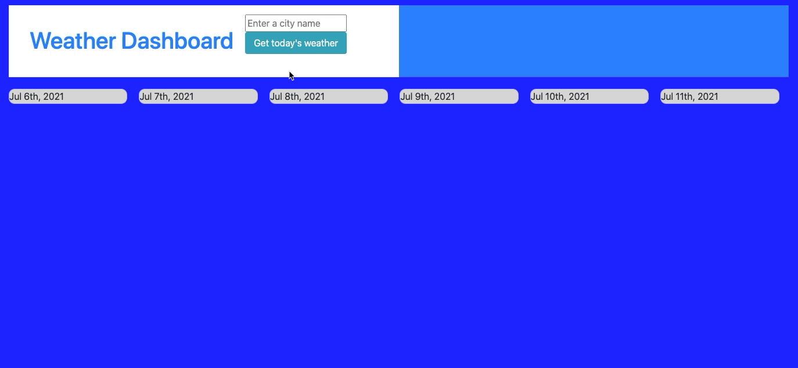

# weather-dashboard
## Get the weather conditions in any city, including a 5-day forecast!
<!-- Instructions for use -->
Link to app: https://jamesboblak.github.io/weather-dashboard/  
This weather dashboard features a color-changing warning that alerts poor UV Index, today's temperature, weather conditions, relative humidty, and average windspeed, plus a five-day forecast showing weather icons, the temperature, and relative humidity.
 
Simply "Enter a city name" and then click on the Get today's weather button.  This will show today's weather conditions in the city entered, and then will alert the UV Index for today in that city.  If the UVI is healthy, the background for today's card will turn green.  If uVI is moderate, the card will show an orange background, with a red background showing unhealthy UVI conditions in that city today.  Entering a second city adds its data to the cards below the data from the first city for easy comparison.  

<!-- Statement of purpose -->
## Purpose
Quickly and easily get weather conditions in any city, including a five-day forecast and UVI indication alert.  

UV Index below 4.0 turns today's background green.  

UV Index between 4.0 and 8.0 turns today's background orange.  

UV Index above 8.0 turns today's background red.  

## Technology utilized to create this page:
<!-- JavaScript Pionts -->
* JavaScript
    * Functions
    * Moment.js time services
    * Fetch rest.API calls

<!-- JQuery Pionts -->
* JQuery
    * Add class
    * Append data to cells
    * Text query and submission
    * Local storage

<!-- Bootstrap Pionts -->
* Bootstrap
    * Table creation
    * Custom styling
    * flex containers

    <!-- CSS Points -->
* CSS
    * Element, ID, and class styling

<!-- Browser compatiblity -->
## Compatiblity and Installation
This HTML website, its CSS style document, and its JavaScript file were created and tested for Chrome, but will load in any browser.  Most modern browsers should play the content of this page as intended, and without issue.  

<!-- Credits -->
## Credits:
Berkeley Coding Boot Camp | UC Berkeley Extension, w3schools.com, developer.mozilla.org  

<!-- License agreement -->
## License
GNU General Public License v3.0  

<!-- Social badges -->
## Badges

